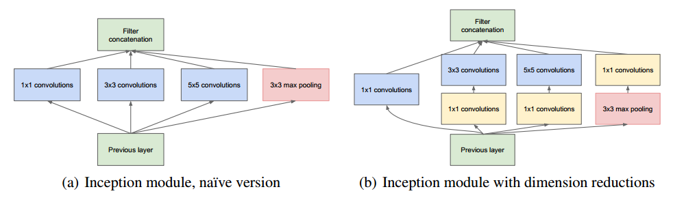

### AlexNet

#### Model

1. Relu

2. LRN
   $$
   b^i_{x,y} = a^i_{x,y}/(k+\alpha\sum^{min(N-1.i+n/2)}_{j=max(0,j-n/2)}(a_{x,y}^{j})^2)^\beta
   $$
   
   $$
   k=2,n=5,\alpha=1*e^{-4},\beta=0.75
   $$
   i,j表示通道数,在前后n/2个通道进行叠加

3. Overlapping Pooling

#### Reducing Overfiting

1. Random Crop + Horizontial Reflection

   [256,256] -> [224,224] + horizontal reflections

2. PAC + 主成分扰动

3. Dropout in FC

### ZFNet

可视化技术

### Net-in-Net

### VGG

#### 小卷积核

1. 降低参数量
2. 增加非线性(层数多)

#### 3 * 3 VS 7 * 7 

3个3*3 的kernel 堆叠感受野为7 * 7

3个3*3卷积核的参数量为 
$$
(3*3*chanel + 1)*chanel*3 =27C^2 + 3C 
$$
一个7*7卷积核的参数量为
$$
(7*7*chanel + 1) * chanel = 49C^2 + C
$$

#### 1 * 1 kernel

1. 调整维度,降低参数量
2. 增加非线性

其他

1. LRN not work
2. 小网络参数初始化大网络 VGG11->VGG13
3. DATA Augment:

### Inception v1

增大网络size可以提高模型表现,但是有两个主要障碍.

1. 参数量变大,过拟合
2. 计算资源不足

解决方法:FC改为稀疏链接

#### inception结构

Feature of higher abstraction are captured by higher layers.Radio of 3*3 and 5 * 5 convolutions should  increase as we move to higher layers.

1 * 1 convolutions are used to compute reduction before the 3 * 3  convolution and 5 * 5 convolution

#### 辅助loss

#### Conclusion

Our results seem to yield a solid evidence that approximating the expected optimal sparse structure by readily available dense building blocks is a viable method for improving neural networks for computer vision. 

### Inception v2

#### Batch Normalization

###### background

而机器学习中有个很重要的假设：IID独立同分布假设，就是假设训练数据和测试数据是满足相同分布的，这是通过训练数据获得的模型能够在测试集获得好的效果的一个基本保障。那么，细化到神经网络的每一层间，每轮训练时分布都是不一致，那么相对的训练效果就得不到保障，所以称为层间的covariate shift(ICS).

BN解决的是梯度消失的问题

###### 数学原理

###### 优点

1. 可以使用更高的学习率
2. 降低或者移除dropout
3. 降低L2权重
4. 替代LRN

#### 可分离卷积

#### 其他

1. 移除Dropout
2. 减小L2正则项
3. 加速LR衰减
4. 移除LRN
5. 两个3*3 conv堆叠代替5 * 5 conv

Q:参数量变化?

### Inception v3

#### 四条原则

+ Avoid representational bottlenecks, especially early in the network.

- Higher dimensional representations are easier to process locally within a network.
- Spatial aggregation can be done over lower dimensional embeddings without much or any loss in representational power.
- Balance the width and depth of the network.

#### 如何分解大卷积核的卷积层

1.多层小卷积核代替大卷积核

2. 两层非对称卷积(1 * n,n * 1)代替n * n

#### 如何有效减少特征图尺寸

在分类任务中，许多模型都会随着深度的整长不断通过池化操作缩小特征图尺寸，以此减小模型的“体积”。由于池化操作会导致特征图中的许多信息丢失，许多模型都习惯在特征图的宽与高缩小一半的同时，利用卷积核为  1 × 1 的卷积层使得特征图的通道数量翻倍（即 C × W × H -> 2C × W/2 ×  H/2），以此减少池化操作所带来的信息丢失。

这样操作有两种选择：先进行升维操作，再进行池化操作；先进行池化操作，再进行升维操作。作者指出，根据原则一，我们应先进行升维操作，再进行池化操作。

本文提出了另外一种方法

### Inception v4

### ResNet

#### 残差单元

退化问题:增加网络深度时准确度出现下降

$$
y_l = h(x_l) + F(x_l,W_l)  
$$

$$
x_{l+1} = f(y_l)
$$

其中$x_l$,$x_{l+1}$是第$l$个残差单元的输入输出,$F$是残差函数,$h(x)=x$是恒等映射,激活函数$f$是Relu

由浅层$l$到深层$L$的学习特征为
$$
x_L=x_l + \sum_{i=l}^{L-1}F(x_i,W_i)
$$
##### Basic Block & Bottleneck Block

ResNet中使用的两种残差单元

单层计算量计算公式
$$
FLOPs=(H*W*C_{out})*(K^2*C_{in})
$$
计算量
$$
BB = H*W*3^2*64*64 + H*W*3^2*64*64=(9+9)*(64^2*H*W)
$$

$$
BNB = H*W*256*64 + H*W*3^2*64*64 + H*W*64*256 = (9+8)*(64^2*H*W)Xception
$$
### Xception

#### 可分离卷积

### SENet

#### Squeeze

average pooling
$$
z_c=F_{sq}(u_c)=\frac{1}{H+W}\sum_{i=1}^{H}\sum_{j=1}^{W}u_c(i,j)
$$

#### Excitation

$$
s=F_{ex}(z,W)=\sigma(W_2\delta(W_1z)),\delta = Relu
$$

$$
\widetilde{x_c}=F_{scale}(u_c,s_c)=s_cu_c
$$
通过网络根据loss去学习特征权重

### ResNeXt

+ 网络结构简明，模块化

+ 需要手动调节的超参少

+ 与 ResNet 相比，相同的参数个数，结果更好\

#### group conv

对比ResNet的结构

block参数量:
$$
Resnet=1^2*256*64 + 3^2*64*64+1^2*64*256 = 2^{15} + 9*2^{16}
$$

$$
ResNeXt  = (1^2*256*4 + 3^2*4*4 + 1^2*4*256) * 32 = 2^{16} + 9*2^9
$$

最终结构

### DenseNet

密集连接,鼓励特征复用

#### Bypass

### ShuffleNet